# Inventory Management System

 
This project is implementing an inventory management system.
 
The project includes:
 
- spring-boot application with a REST API controller
 
- Swagger API catalog
 
- H2 DB using JPA
 
- Angular.js pages for read/delete/add items to the inventory system

   

<h2>Screenshots:</h2>
   

    <h3>Swagger UI:</h3>
    Item controller HTTP methods
     
    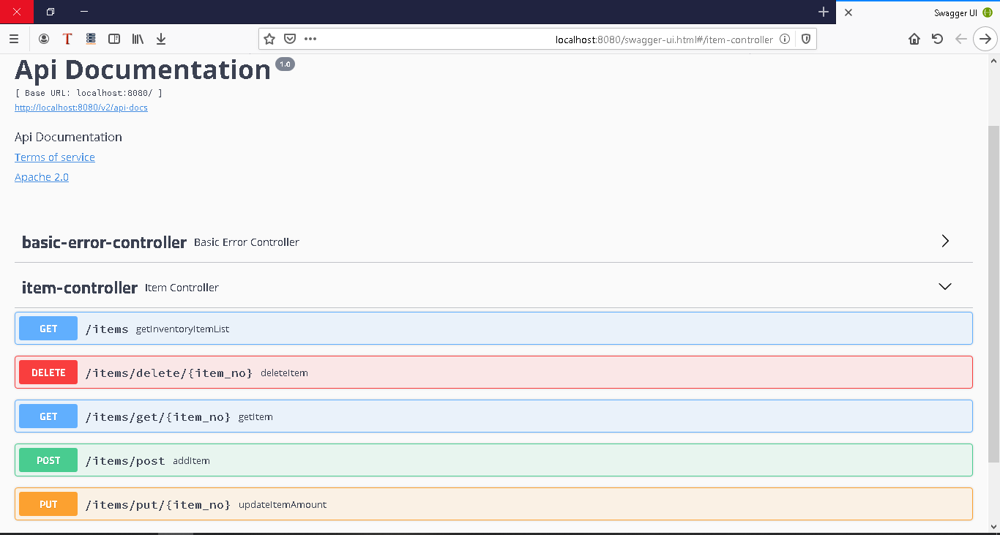
              
    Add item "coke" to the stock
                 
    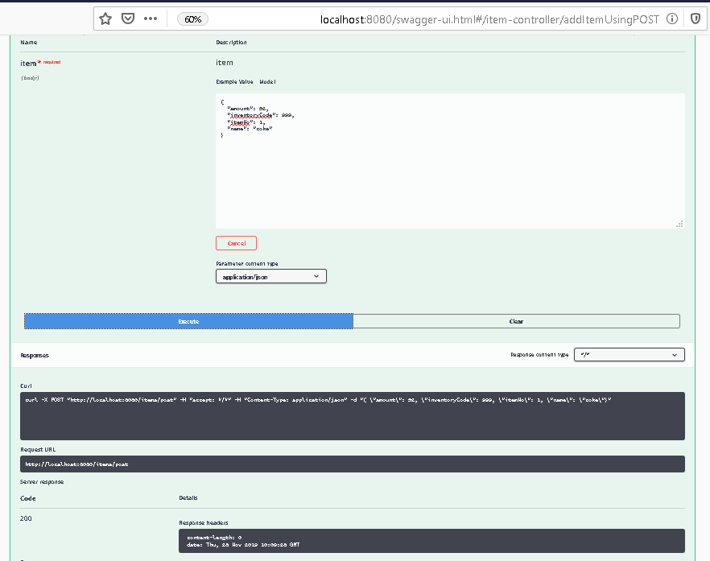
                 
    Add item "sprite" to the stock
                 
    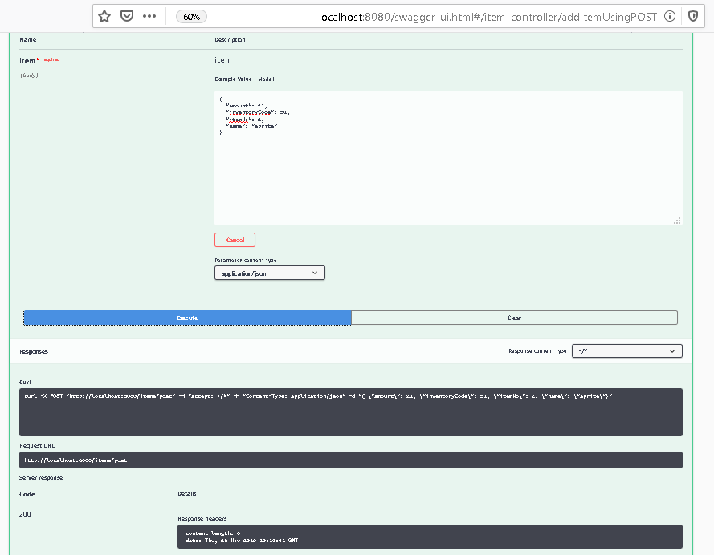
                 
    Get a list of the inventory items list
                 
    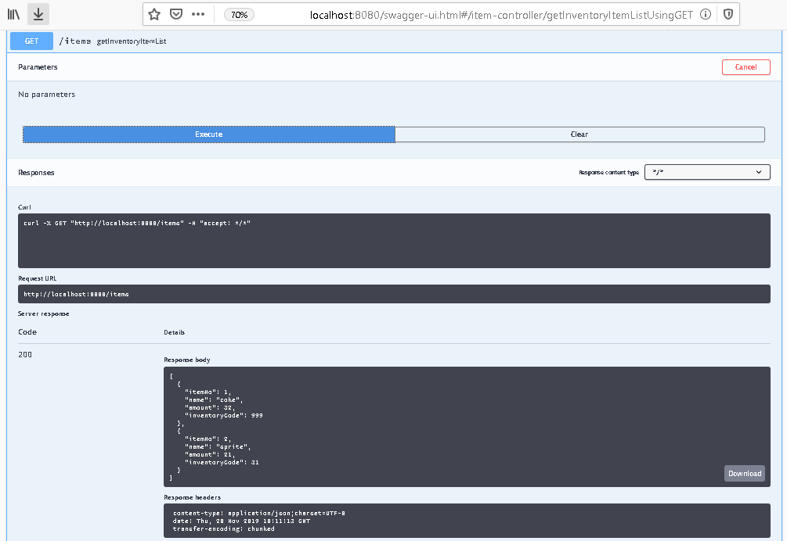
          
    Read item details (by item number)
                 
    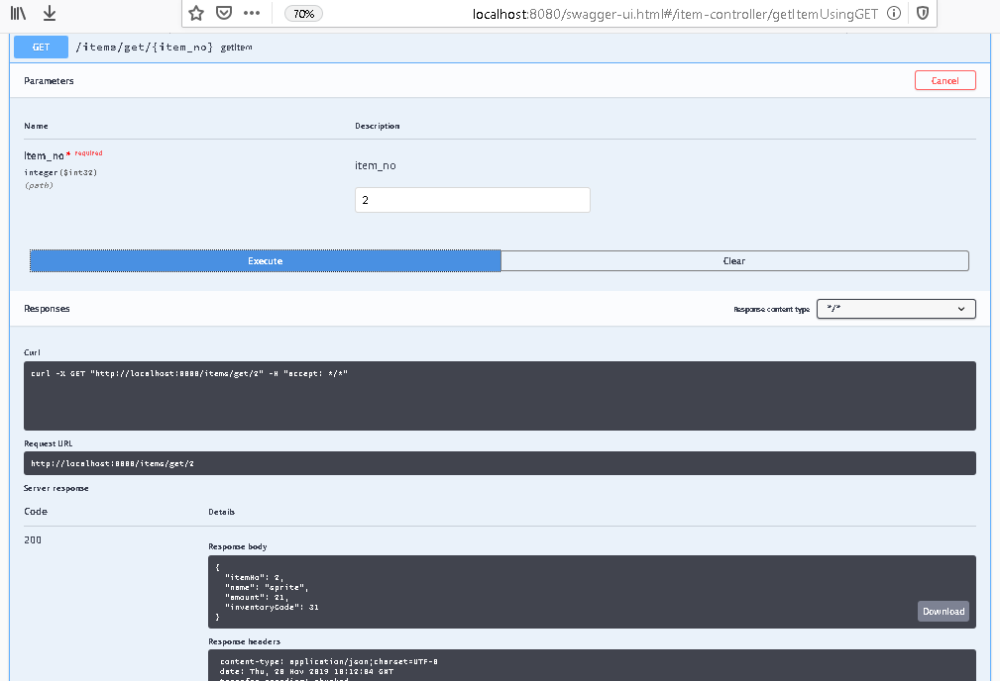
          
    Deposit/Withdrawal quantity of a specific item ("coke") to stock
                 
    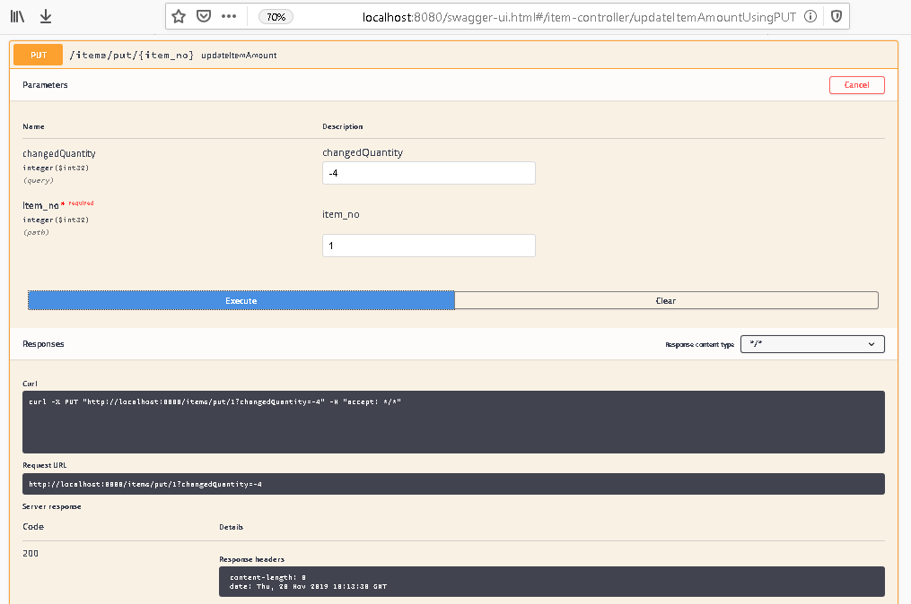
          
    Display the changes
                 
    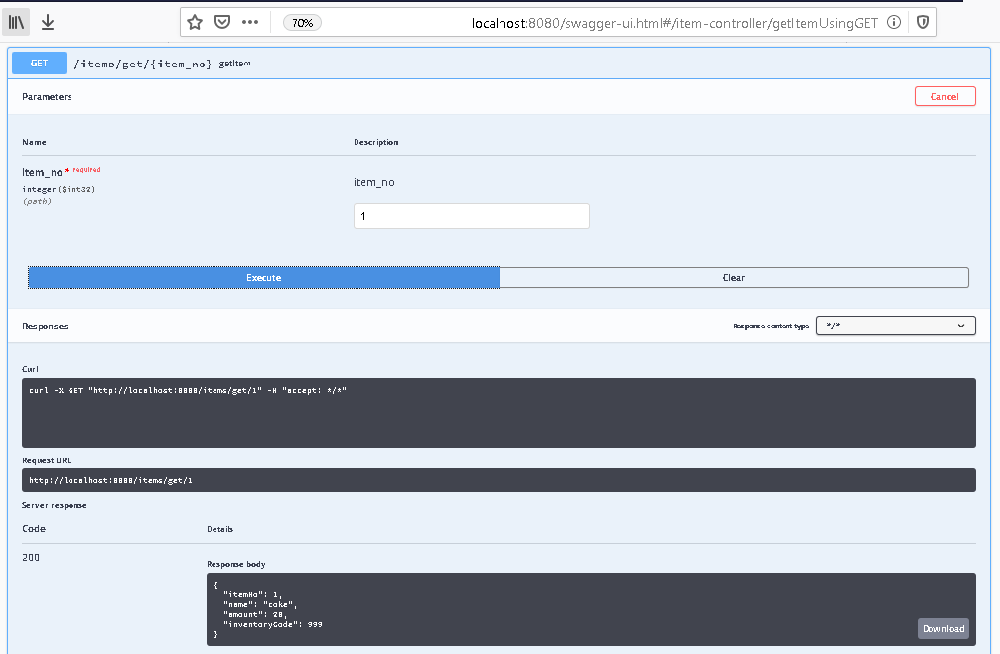
          
    Delete the item "coke" from the stock (by item number)
                 
    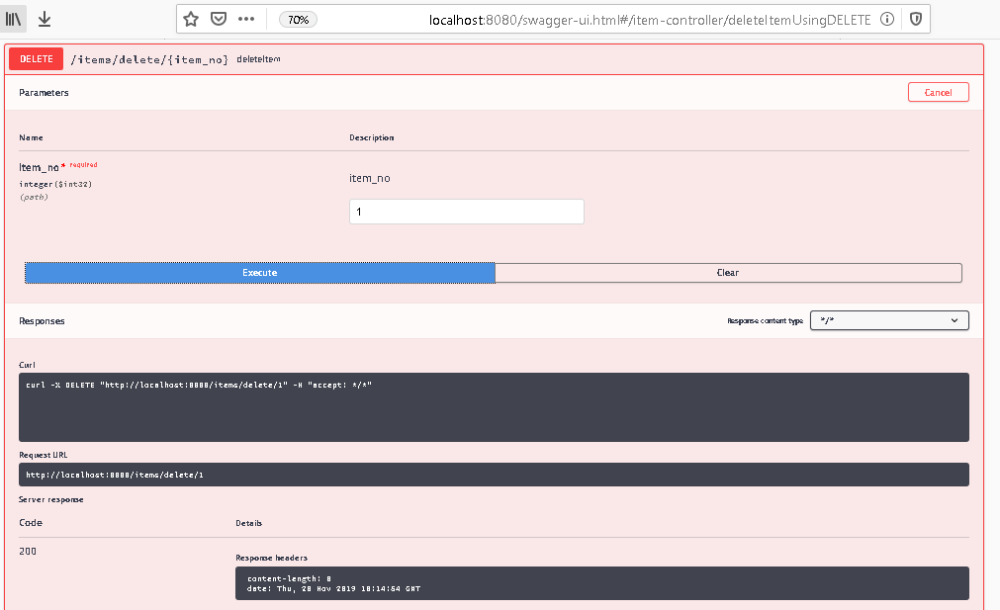
          
    Display all items list in order to prove that the item "coke" has been deleted
                 
    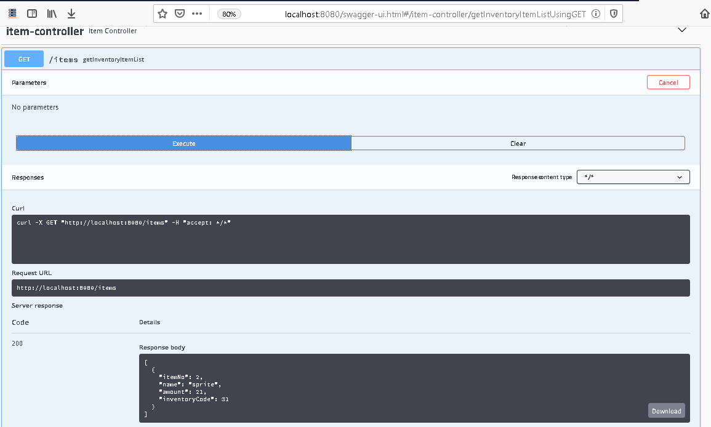

================================================================================
             

    <h3>h2-console</h3>
    Select all items from the ITEM table
     
    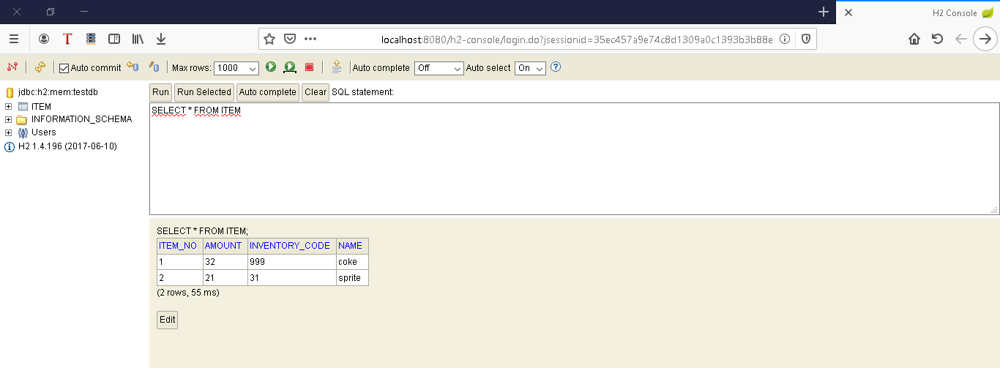

================================================================================
        

    <h3>Angular.js Pages</h3>
    Successfully compilation
     
    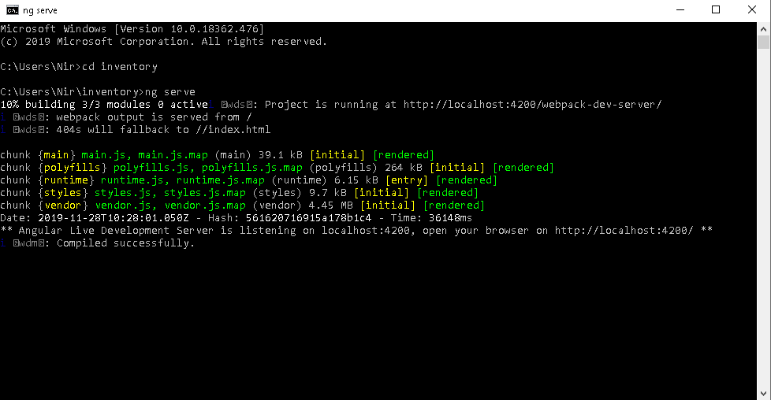
                 
    Main page (empty page)
     
    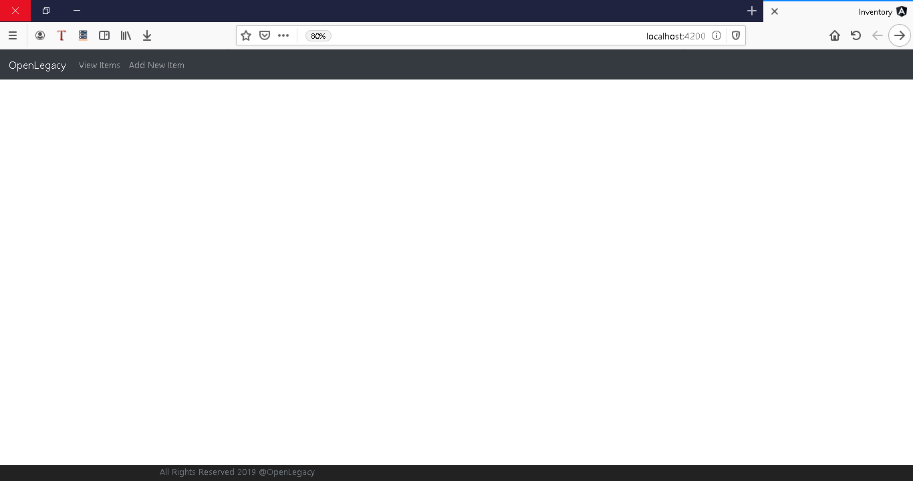
             
    View Items
     
    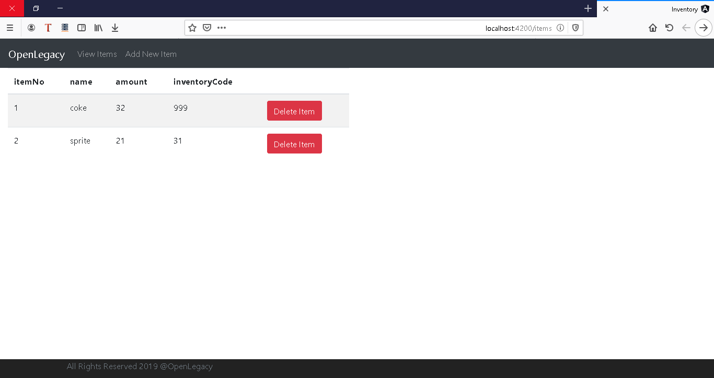
           
    Clicking the delete button of "sprite" item cause a deletion
     
    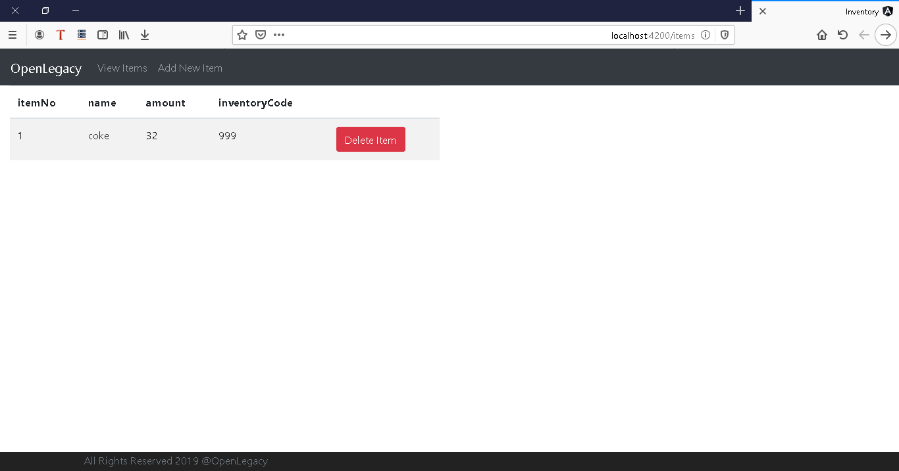
           
    Add Item "pasta"
     
    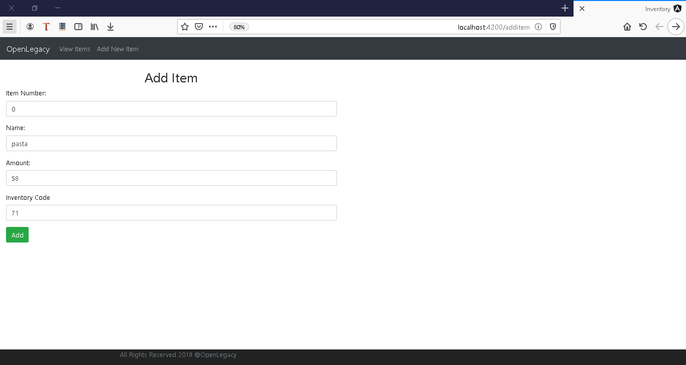
    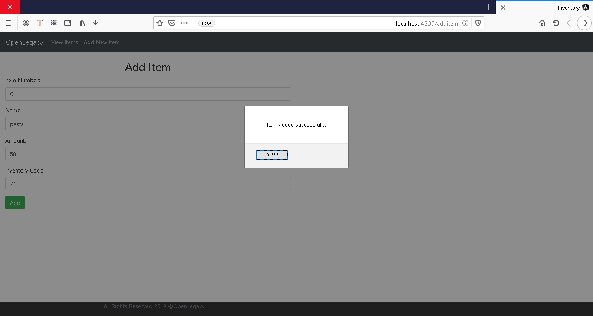
           
    Display the added item on the items list
     
    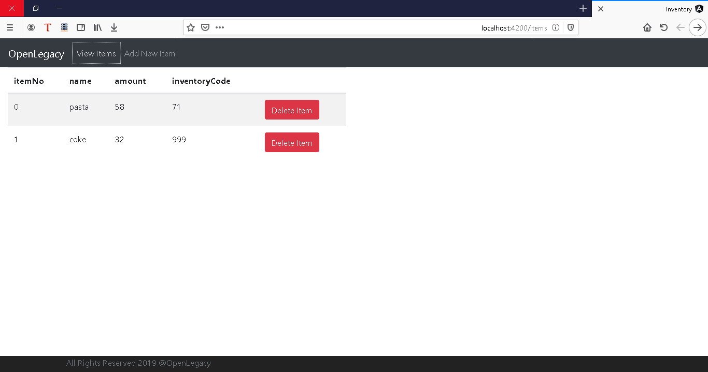
           
    A prove that the item "pasta" has been added in the Swagger UI
     
    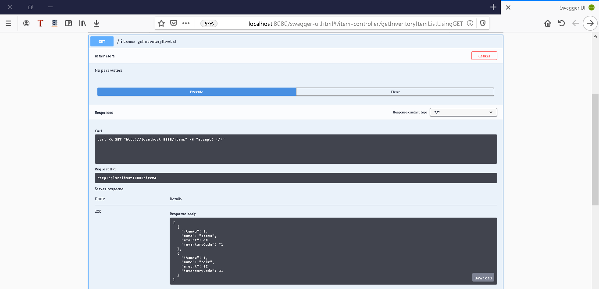

 
